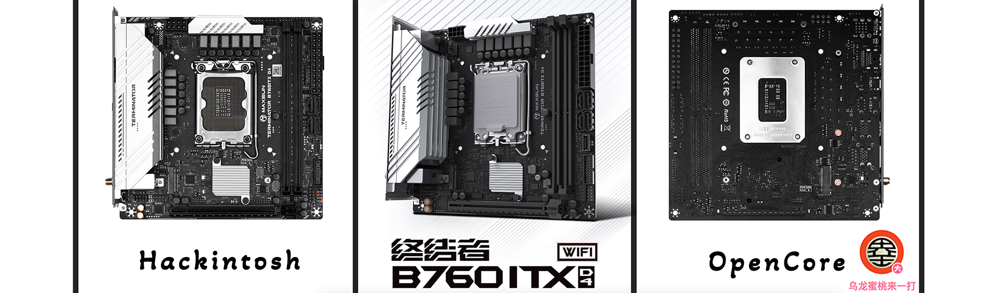

## 铭瑄-终结者 B760ITX D4 WIFI 黑苹果 OpenCore EFI



### OpenCore

[OpenCore 0.9.5](https://github.com/acidanthera/OpenCorePkg)

### macOS

- macOS Monterey 12.x
- macOS Ventura  13.x 
- macOS Sonoma 14.x

### 硬件

- 芯片组: B760
- Bios 版本: 1.8D（2023-06-26）
- 处理器: 英特尔12代 i7-12700
- 内    存: 玖合 32G*2 DDR4 3200MHz
- 硬    盘: Crucial 英睿达 P5 1TB 3D NAND NVMe
- 硬    盘: 京东京造 J.ZAO QL SERIES 1TB SSD
- 核    显: 英特尔超核心显卡730 (仅在Windows中可以使用)
- 独    显: 蓝宝石 AMD Radeon RX6600XT 白金版OC
- 声    卡: 瑞昱 ALC897
- 有线网卡: 瑞昱 8125 2.5GbE
- 无线网卡: 英特尔 AX211 （EFI中WiFi驱动适用于Ventura版本）
- 机    箱:  闪鳞 S300
- 电    源: 钢影Toughpower SFX 650W金牌认证电源

### BIOS设置

```

|-- VT-d：关闭
|-- Above 4G decoding：开启
|-- Resizable Bar：开启
|-- EHCI/XHCI Hand-off：开启
|-- CSM Support：关闭
|-- Fast Boot：关闭
|-- Secure Boot：关闭
|-- CFG LOCK：关闭

```

### 注意事项

 - 安装成功后必须使用 [OpenCore Configurator](https://mackie100projects.altervista.org/opencore-configurator/) 或者 [OCAuxiliaryTools](https://github.com/ic005k/OCAuxiliaryTools) 生成你自己的 SMBIOS

### 关于本机


### 参考内容

[1.黑苹果安装过程演示](https://hackintosh.club/d/10000060)

[2.英特尔无线网卡WiFi驱动](https://hackintosh.club/d/10000015)

[3.英特尔无线网卡蓝牙驱动](https://hackintosh.club/d/10000017)

[4.我的B站黑苹果教程](https://space.bilibili.com/244390800/video)

[6.黑果之家](https://hackintosh.club)

### 联系我们

QQ群: 23304408


### 常用工具

- [Hackintool](https://github.com/headkaze/Hackintool) 
- [OCAuxiliaryTools](https://github.com/ic005k/OCAuxiliaryTools) AKA `OCAT`.
- [OpenCore Configurator](https://mackie100projects.altervista.org/opencore-configurator/) AKA `OCC`.
- [gibMacOS](https://github.com/corpnewt/gibMacOS) Build your own MacOS image.
- [ProperTree](https://github.com/corpnewt/ProperTree) Plist editor.